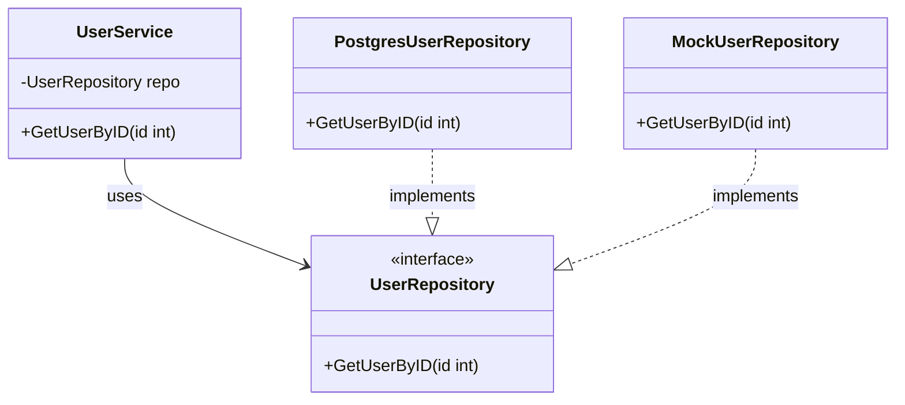

# บทที่ 3 Interface

- ในบทนี้เราจะอธิบายพื้นฐานของ Interface ด้วย `shape package`
- และมีตัวอย่างการใช้ง่านที่ค่อนข้างจะสมจริงใน `user package`

**_ในบทนี้ค่อนค้างจะเป็นบทที่สำคัญมากๆ ใน GO เลย_**

## สิ่งที่ต้องรู้มาก่อน

- พื้นฐานภาษา GO

## Interface คืออะไร?

Interface คือ ชนิดข้อมูลที่ใช้สร้าง "Interface" ไม่ได้กวนครับ แต่ขอขยายความคำว่า "Interface" หน่อย

Interface คือ เป็นเหมือนคนกลางระหว่างโค้ดสองส่วน โดยคนกลางมีหน้าที่กำหนดกฏกติกาที่ทั้งสองส่วนของโค้ดต้องปฏิบัติตาม แต่สามารถปฏิบัติในแบบของตนเองได้ ไปดูตัวอย่างกัน

### ตัวอย่าง

มือปืนคือโค้ดส่วนที่หนึ่งและมีทั้งสองปืนพกกับปืนลูกซองเป็นโค้ดอีกส่วน หากมือปืนจะใช้ปืนเนื่องจากมีสองปืนแต่ทั้งสองปืนนั้นมีแค่สอง Operation คือ `Shoot()` และ `Reload()`

ในส่วนนี้เรากำหนด `GunInterface` และกำหนดกฏว่าจะเป็นปืนได้ต้องมี

- `Shoot()`
- `Reload()`

จึงจะสมัครเป็นปืนให้มือปืนได้นั้นเอง และปืนลูกซองอาจจะมีการทำงาน Implemation ของ `Shoot(), Reload()` ต่างจากปืนพกก็ได้ แต่! ขอแค่มีสอง Operation นั้น

ทีนี้มือปืนจะใช้ปืนได้ต้องผ่าน `GunInterface` เพื่อป้องกันปืนใดๆ ที่ไม่มีทั้งสอง Operation (อาจจะเกิด Error ได้)

## การสร้าง Interface

ให้คุณเปิดไปที่ไฟล์ `./shape/shape.go` คุณจะเห็นมีโค้ดส่วนหนึ่งคือ

```go
package shape

type Shape interface {
	Area() float64
	Perimeter() float64
}
```

### ทีนี้เราจะทำโค้ดส่วนที่ต้อง Implement ตาม Interface กัน

1. Value Receiver แบบไม่ใช้ Pointer

```go
type Circle struct {
	Radius float64
}

func (c Circle) Area() float64 {
	return math.Pi * c.Radius * c.Radius
}

func (c Circle) Perimeter() float64 {
	return 2 * math.Pi * c.Radius
}
```

2. Pointer Receiver แบบที่ใช้ Pointer

```go
type Rectangle struct {
	Length, Width float64
}

func (r *Rectangle) Area() float64 {
	return r.Length * r.Width
}

func (r *Rectangle) Perimeter() float64 {
	return 2 * (r.Length + r.Width)
}
```

#### Value Receiver VS Pointer Receiver

| หัวข้อ           | Value Receiver | Pointer Receiver |
| -------------- | -------------- | ---------------- |
| nil ได้ไหม      | ❌              | ✅ (ต้องเช็คเอง)    |
| แก้ค่า struct ได้ | ❌              | ✅                |
| memory         | ใช้มากกว่า       | ประหยัดกว่า        |
| ความควรใช้      | ❌              | ✅                |

สรุปใช้ Pointer Receiver ดีที่สุด

### ตัวอย่างการใช้งาน
ให้คุณเปิดไปที่ไฟล์ `./main.go` คุณจะเห็นมีโค้ดส่วนหนึ่งคือ
```go
package main

func main() {
	fmt.Println("Shape Interface Example")
	var s shape.Shape

	s = shape.Circle{Radius: 5}
	fmt.Println("C Area:", s.Area())
	fmt.Println("C Perimeter:", s.Perimeter())

	s = &shape.Rectangle{Length: 4, Width: 3}
	fmt.Println("R Area:", s.Area())
	fmt.Println("R Perimeter:", s.Perimeter())
    ...
}
```
### ประเด็นที่ควรรู้
- ใครจะ Implement ตาม Interface ได้ต้องมีกฏว่า `เกินได้ห้ามขาด`

#### ตัวอย่างการขาด
```go
type Triangle struct {
	Base, Height float64
}

func (t *Triangle) Area() float64 {
	return 0.5 * t.Base * t.Height
}

// No Implementation for Perimeter method.
// This will cause a compile-time error if we try to use Triangle as a Shape interface.
```
- มี `Area()`
- ไม่มี `Perimeter()`

แบบนี้จะ***ไม่***สามารถใช้เป็น Implementation ของ `Shape` ได้

#### ตัวอย่างการเกิน
```go
type Trapezoid struct {
	BaseTop    float64
	BaseBottom float64
	Height     float64
	SideLeft   float64
	SideRight  float64
}

func (t *Trapezoid) Area() float64 {
	return 0.5 * (t.BaseTop + t.BaseBottom) * t.Height
}

func (t *Trapezoid) Perimeter() float64 {
	return t.BaseTop + t.BaseBottom + t.SideLeft + t.SideRight
}

func (t *Trapezoid) Test() float64 {
	return 67.00
}
```
- มี `Area()`
- มี `Perimeter()`
- มี `Test()`

แบบนี้จะสามารถใช้เป็น Implementation ของ `Shape` ได้

## ตัวอย่างการใช้งาน Interface ที่สมจริงมากขึ้น



จากภาพคือ `UserService` จะใช้งาน Database จะต้องใช้ผ่านทาง Interface `UserRepository` เท่านั้น
- โดย `PostgresUserRepository` จะเป็น Implementation ของ `UserRepository` และเชื่อมต่อกับ Database จริง
- โดย `MockUserRepository` จะเป็น Implementation ของ `UserRepository` และไม่ได้เชื่อมต่อกับ Database

```go
type User struct {
	ID    int
	Name  string
	Email string
}

// Interface
type UserRepository interface {
	GetUserByID(id int) (*User, error)
}

// Service
type UserService struct {
    // Using Interface
	Repo UserRepository
}
```

### PostgresUserRepository
สมมุติว่าเชื่อมต่อ Database
```go
type PostgresUserRepository struct {
	// db *sql.DB // Assume we have a database connection here
}

func (p *PostgresUserRepository) GetUserByID(id int) (*User, error) {
	// Simulate database fetch
	return &User{ID: id, Name: "DB User", Email: "dbuser@example.com"}, nil
}
```

### MockUserRepository
เป็น Mock database ไม่ได้เชื่อมต่อ Database จริง
```go
type MockUserRepository struct {
	Users map[int]User
}

func (m *MockUserRepository) GetUserByID(id int) (*User, error) {
	user, exists := m.Users[id]
	if !exists {
		return nil, fmt.Errorf("user not found")
	}
	return &user, nil
```

### ทำไมต้องแยก Mock กับ Postgres
- Testability ทำให้ทดสอบด้วย Unit test โดยไม่ต้องเชื่อมกับ Database จริงๆ
- Flexibility ถ้าอยากเปลี่ยนจาก Postgres เป็น MongoDB ก็แค่ Implement `UserRepository`