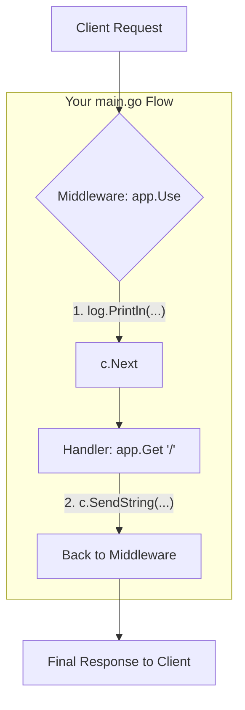

# บทที่ 10 Fiber

## สิ่งที่ต้องรู้มาก่อน
- พื้นฐานภาษา GO
- REST API
- ถ้าเคยเขียน Express.js มากก่อนจะเรียนรู้ได้เร็วมาก (ไม่จำเป็น)

## Fiber คืออะไร?
Fiber คือ Library ที่ช่วยเราทำ REST API ได้ง่ายๆ โดย Fiber นั้นได้แรงบันดาลใจมากจาก Express.js หากใครที่เคยใช้เจ้าตัวนี้มาก่อนจะทำให้เรียนรู้ได้ไวมาก

## การติดตั้ง
```go
go mod init
go get github.com/gofiber/fiber/v3
```

## การใช้งาน
### 1. การเปิด Server
```go
package main

import (
	"log"

	"github.com/gofiber/fiber/v3"
)

func main() {
	app := fiber.New()

    // Routing Here

	err := app.Listen(":3000")
	log.Println("Server started on port 3000...")
	if err != nil {
		log.Fatal(err)
	}
}
```
- เปิดที่ `Port 3000`
- `Routing Here` คือส่วนที่ไว้สร้าง Route

### หลักจากนี้แนะนำให้ใช้ Postman ในการยิง Request เพื่อความสะดวก หรือจะใช้อะไรก็ได้ที่สามารถยิง API ได้

#### 2. Hello World Route แรกเพื่อไว้ครู!!!
```go
package main

import (
	"log"

	"github.com/gofiber/fiber/v3"
)

func main() {
	app := fiber.New()

    app.Get("/", func(c fiber.Ctx) error {
		return c.SendString("Hello, World!")
		// => Response: "Hello, World!"
	})

	err := app.Listen(":3000")
	log.Println("Server started on port 3000...")
	if err != nil {
		log.Fatal(err)
	}
}
```
ผลลัพธ์คือ


### 3. ลองใช้ Method อื่นๆ
```go
app.Post("/api", func(c fiber.Ctx) error {
		return c.SendString("POST request received")
		// => Response: "POST request received"
})
```

ผลลัพธ์คือ


### 4. Path Variables
```go
// Path parameter example
app.Get("/api/user/:id", func(c fiber.Ctx) error {
	id := c.Params("id")
	return c.SendString("User ID: " + id)
	// => Response: "User ID: <id>"
})
```

ผลลัพธ์คือ


### 5. Query parameter
```go
app.Get("/api/search", func(c fiber.Ctx) error {
	query := c.Query("q")
	return c.SendString("Search query: " + query)
	// => Response: "Search query: <q>"
})
```

ผลลัพธ์คือ


### 6. การอ่านค่า Request Body
```go
// Request body parsing example
type User struct {
	Name  string `json:"name"`
	Email string `json:"email"`
}
app.Post("/api/user", func(c fiber.Ctx) error {
	var user User
	err := c.Bind().Body(&user)
	if err != nil {
		return err
	}
	return c.JSON(user)
})
```

ผลลัพธ์คือ


### 7. Response กลับไปเป็น Json
```go
// Response example with JSON Using fiber.Map
app.Get("/api/json", func(c fiber.Ctx) error {
	return c.JSON(fiber.Map{
		"message": "Hello from JSON response",
		"status":  "success",
	})
})

// Response example with JSON Using struct
type Response struct {
	Message string `json:"message"`
	Status  string `json:"status"`
}
app.Get("/api/struct", func(c fiber.Ctx) error {
	return c.JSON(Response{
		Message: "Hello from struct response",
		Status:  "success",
	})
})
```
- สามารถใช้ `Struct` ได้หรือ `fiber.Map(..)` ก็ได้

ผลลัพธ์คือ


### 8. Middleware
Middleware คือ Function ที่ Request จะต้องผ่านก่อนที่จะไปทำงานใน Controller/Handler

ตัวอย่างที่ 1
```go
package main

import (
	"log"

	"github.com/gofiber/fiber/v3"
)

func main() {
	app := fiber.New()

    // Middleware example 1
	// Logs each request method and path
	// Useful for debugging, monitoring, Error handling, etc.
	app.Use(func(c fiber.Ctx) error {
		// Log each request
		log.Println("Request received: " + c.Method() + " " + c.Path())
		return c.Next()
	})

	app.Get("/", func(c fiber.Ctx) error {
		return c.SendString("Hello, World!")
		// => Response: "Hello, World!"
	})

	err := app.Listen(":3000")
	log.Println("Server started on port 3000...")
	if err != nil {
		log.Fatal(err)
	}
}
```

การทำงานจะเปรียบเสมือนว่า

- เมื่อ Middleware ทำงานถึง `c.Next` จะทำให้สามารถไปทำงาน handler ได้ และจะกลับมาทำงานหลัง `c.Next` 
- แต่ในที่นี้ผม return `c.Next` และไม่มีโค้ดหลังจากนั้นแล้ว
- สามารถใช้ Log/Monitor ได้

ตัวอย่างที่ 2
```go
package middlewares

import (
	"log"

	"github.com/gofiber/fiber/v3"
)

func MiddlewareExample(c fiber.Ctx) error {
	// Example middleware function
	log.Println("Middleware executed")
	return c.Next()
}

```
และใน `main.go`
```go
// Middleware example 2
// Useful for authentication, logging, etc.
app.Get("/api/middleware", middlewaresMiddlewareExample, func(c fiber.Ctx) error {
	return c.SendString("Middleware example route")
})
```
- แบบนี้จะคุม `Scope` ให้ Middleware ทำงานแค่ Route นี้ได้

ผลลัพธ์คือ


Logging
```
2026/02/10 14:14:08 Request received: GET /api/middleware
2026/02/10 14:14:08 Middleware executed
```

### 9. Error Handling
```go
// Error handling example
app.Get("/api/error", func(c fiber.Ctx) error {
	return fiber.NewError(fiber.StatusBadRequest,"This is a bad request example")
})
```
- `fiber.NewError(code int, message ...string)` เพื่อ Throw Error ที่ fiber สามารถจัดการได้
- [เอกสาร](https://docs.gofiber.io/guide/error-handling) หากต้องการตั้งค่าอะไรให้เข้ามาอ่านได้ที่นี้