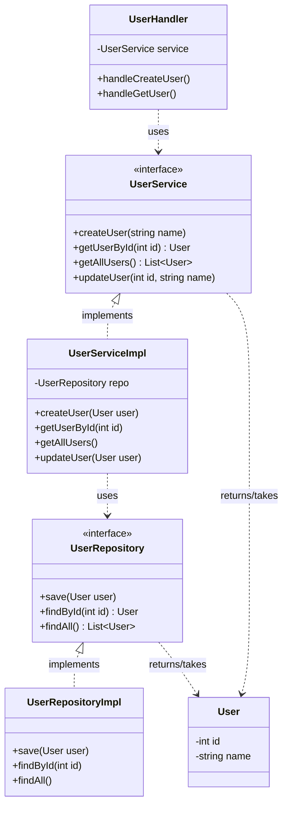
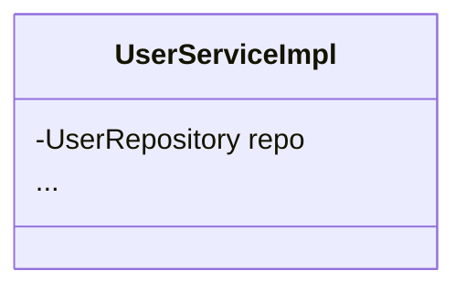

# บทที่ 11 Hexagonal architecture

บทนี้ค่อนข้างยากแนะนำให้ถาม Generative Ai หากมีข้อสงสัย จงใช้เวลากับบทนี้เพราะมีประโยชน์มากๆ และอาจจะมีประโยชน์ในภาษาอื่นๆ ที่ไม่ใช่ Golang

## สิ่งที่ต้องรู้มาก่อน
- พื้นฐานภาษา GO
- บทที่ 8 Project structure
- บทที่ 9 GORM
- บทที่ 10 Fiber

## Hexagonal architecture คืออะไร?
มันคือ Software pattern อันหนึ่งที่ช่วยให้ Software ของเรา

แยก Business Logic ออกจาก Technology
- ทดสอบได้ง่าย (Testability)
  - เพราะสามารถทดสอบ Business Logic โดยไม่ต้องเชื่อมต่ออะไรเลย
  - เช่น เราสามารถใช้ Mock database แทนการเชื่อม Database จริงๆ ได้ เพื่อทดสอบแค่ตรรกะ
- เปลี่ยนแปลง/แก้ไขโค้ดง่าย (Maintainability) 
    - เช่น เปลี่ยนจาก PostgreSQL ไปเป็น MongoDB ได้ง่ายไม่ต้องลื้อทั้ง Project

## สถาปัตยกรรม

Ref: https://medium.com/@ebubekiryigit/hexagonal-architecture-a-golang-perspective-7eb3cb6117e7

- `Core` เป็นที่รวบรวม Business Logic, Entity
  - ไม่ขึ้นตรงกับ Framework, External Tools / Infrastructure เลย
- `Port` คือส่วนที่เป็น `interface` ไว้ใช้งาน Core ซึ่งมัน Port จะกำหนดกฏการใช้งาน Core
  - Inbound (ขาเข้า) port เอาไว้สร้าง port ที่เรียกใช้งาน Core
  - Outbound (ขาออก) port เอาไว้สร้าง port ที่ Core เรียนกใช้งาน
- `Adapter` เป็นส่วนที่ `implement` ตาม Port เพื่อที่จะใช้งาน Core นั้นเอง

เพื่อสามารถเปลี่ยน Adapter ได้ง่ายๆ เราควรใช้การ   `Dependency injection`

ถ้าให้เปรียบเทียบกับชีวิตจริงสถาปัตยกรรมนี้เปรียบเสมือนอุปกรณ์ไฟฟ้าแหละ `Port` เช่น type C การจะให้พลังงานกับอุปกรณ์นั้นๆ ได้ต้องอาศัย `Adapter` ที่ใช้ type C ด้วยนั้นเอง

แนวคิดนี้เราจะเอาพวก Technologies (Framework, Infra) เป็น `Adapter` ดังนั้นถ้าวันหนึ่งเราอยากเปลี่ยน Tech stack เราสามารถ Implement Adapter เพื่อใช้งาน Core (Service, Entity)

นอกจากนี้มันยังช่วยให้ `Testing` ง่าย เช่นจากปกติเรามี adapter ที่เป็น MongoDB แต่พอเราจะ Testing เราใช้ Mock Database แทน

## มาลองทำกัน (Overview ก่อน)

จากภาพ 
- `Port` ได้แก่ `UserService`, `UserRepository`
- `Adapter` ได้แก่ `UserHandler`, `UserRepositoryImpl`

ในที่นี้ผมอยากจะสร้าง `UserHandler` ด้วย `REST API` ซึ่งจะใช้ `Fiber`

และจะสร้าง `UserRepositoryImpl` ด้วยโดยใช้ Database ซึ่งจะใช้ `Sqlite`

การ `Dependency injection` เช่น

- repo คือไว้ใส่ adapter ที่ implement แล้วของ UserRepository

## มาลองทำกัน 1 (Implement กัน)

```bash
11-hexagonal/
├── internal/
│   ├── core/
│   │   ├── domain/
│   │   │   └── user.go
│   │   ├── ports/
│   │   │   └── user_repository.go
│   │   │   └── user_service.go
│   │   ├── services/
│   │   │   └── user_service_impl.go
│   ├── adapters/
│   │   │   └── ... # Later
```

### ขั้นตอนที่ 0 สร้าง Domain Entity
ไฟล์
```go
package domain

// User entity
type User struct {
	ID   uint
	Name string
}
```
มันคือ class ข้อมูลที่ไม่เกี่ยวกับ Infrastructure ใดๆ เลย เป็น Pure logic entity ที่ไม่ผูกติดกับ Infrastructure เช่น Database
- ขอยกตัวอย่างแก้ความสงสัย แล้วจะให้ Database คุยกับ entity ตัวนี้ยังไง คำตอบคือ Adapter ต้องแมพ Model ของตนเองให้เข้ากับ Entity ด้วยตนเอง เพื่อให้ใช้งาน Service จาก Core ได้
- ใช่มันลำบาก เหมือนขี้ช้างไล่จับตั๊กแตน แต่ข้อดีของการทำแบบนี้ก็คือความยืดหยุ่นที่ไม่ผูกมัดกับ Technologies ใดๆ

### ขั้นตอน 1 เริ่มจาก Ports
การสร้าง Port ให้ใช้ `Interface`

ไฟล์ `./internal/ports/user_repository.go`
```go
package ports

import "github.com/Nextjingjing/go-god/11-hexagonal/internal/core/domain"

// Outbound port
type UserRepository interface {
	Save(user *domain.User) (*domain.User, error)
	FindByID(id uint) (*domain.User, error)
	FindAll() ([]*domain.User, error)
}
```
ไฟล์ `./internal/ports/user_service.go`
```go
package ports

import "github.com/Nextjingjing/go-god/11-hexagonal/internal/core/domain"

// Inbound port
type UserService interface {
	CreateUser(name string) (*domain.User, error)
	GetUserByID(id uint) (*domain.User, error)
	GetAllUsers() ([]*domain.User, error)
	UpdateUser(id uint, name string) (*domain.User, error)
}
```

การสร้าง Port เปรียบเสมือนการสร้างกฏหมาย/มาตราฐานให้ adapter ปฏิบัติตามนั้นเอง เช่น

```go
type UserRepository interface {
	Save(user *domain.User) (*domain.User, error)
    ...
}
```

`Save(user *domain.User) (*domain.User, error)` จะบอก Adapter ว่าต้องมี method นี้และต้องมี Parameter อะไรบ้าง? และต้อง return เป็นอะไร?

### ขั้นตอน 2 Implement Service ใน Core
```go
package services

import (
	"github.com/Nextjingjing/go-god/11-hexagonal/internal/core/domain"
	"github.com/Nextjingjing/go-god/11-hexagonal/internal/core/ports"
)

// Implementation of UserService
// Best practice: keep implementation privately hidden
type userServiceImpl struct {
	repo ports.UserRepository
}

func NewUserServiceImpl(repo ports.UserRepository) ports.UserService {
	return &userServiceImpl{repo: repo}
}

func (s *userServiceImpl) CreateUser(name string) (*domain.User, error) {
	user := &domain.User{Name: name}
	return s.repo.Save(user)
}

func (s *userServiceImpl) GetUserByID(id uint) (*domain.User, error) {
	return s.repo.FindByID(id)
}

func (s *userServiceImpl) GetAllUsers() ([]*domain.User, error) {
	return s.repo.FindAll()
}

func (s *userServiceImpl) UpdateUser(id uint, name string) (*domain.User, error) {
	return s.repo.Save(&domain.User{ID: id, Name: name})
}
```
อยากให้เห็นการทำ Dependency injection
```go
type userServiceImpl struct {
	repo ports.UserRepository
}
```
เพื่อให้สามารถเปลี่ยน adapter ง่ายๆ

```go
// Implementation of UserService
// Best practice: keep implementation privately hidden
type userServiceImpl struct {
	repo ports.UserRepository
}

func NewUserServiceImpl(repo ports.UserRepository) ports.UserService {
	return &userServiceImpl{repo: repo}
}
```
- เราจะ Private คลาสนี้ไม่ให้สร้างตรงๆ
- เราจะสร้าง `NewUserServiceImpl` คล้ายๆ Consturctor ใน OOP เอาไว้สร้าง Struct ตัวนี้

## มาลองทำกัน 2 (ลุย Outbound adapter)
```bash
11-hexagonal/
├── internal/
│   ├── core/

    ...

│   ├── adapters/
│   │   ├── sqlite/
│   │   │   └── user_model.go
│   │   │   └── user_repository_impl.go
│   │   ├── handler/
│   │   │   └── ... # Later
```

เนื่องจากเราต้องใช้ Model ของ Database เพื่อสร้าง Table 

ไฟล์ `user_model.go`
```go
package sqlite

import "gorm.io/gorm"

// Declaring User Model
type UserModel struct {
	gorm.Model
	ID   uint `gorm:"primaryKey"`
	Name string
}

```
- มันแมพไปเป็น User entity ใน Core ได้
- `gorm.Model` จะเพิ่ม field `CreatedAt`, `UpdatedAt`, `DeletedAt`

| Entity Field (Target) | Model Field (Source) | Transformation / Logic |
| :--- | :--- | :--- |
| `ID` | `ID` | **Direct Map** (Primary Key) |
| `Name` | `Name` | **Direct Map** |
| - | `CreatedAt` | **Dropped** (ไม่นำไปใช้ใน Domain) |
| - | `UpdatedAt` | **Dropped** (ไม่นำไปใช้ใน Domain) |
| - | `DeletedAt` | **Dropped** (ไม่นำไปใช้ใน Domain) |

มา Implement outbound adpter 

ไฟล์ `user_repository_impl.go`
```go
package sqlite

import (
	"github.com/Nextjingjing/go-god/11-hexagonal/internal/core/domain"
	"gorm.io/gorm"
)

// Implementation of UserRepository
// Best practice: keep implementation privately hidden
type userRepositoryImpl struct {
	db *gorm.DB
}

func NewUserRepositoryImpl(db *gorm.DB) *userRepositoryImpl {
	return &userRepositoryImpl{db: db}
}

func (r *userRepositoryImpl) Save(user *domain.User) (*domain.User, error) {
	userModel := &UserModel{
		ID:   user.ID,
		Name: user.Name,
	}
	// check if user exists
	if user.ID != 0 {
		var existing UserModel
		err := r.db.First(&existing, user.ID).Error
		// if not found, reset ID to 0 to create new record
		if err != nil {
			userModel.ID = 0
		}
	}

	if err := r.db.Save(userModel).Error; err != nil {
		return nil, err
	}

	return &domain.User{
		ID:   userModel.ID,
		Name: userModel.Name,
	}, nil
}

func (r *userRepositoryImpl) FindByID(id uint) (*domain.User, error) {
	var user UserModel
	if err := r.db.First(&user, id).Error; err != nil {
		return nil, err
	}
	return &domain.User{
		ID:   user.ID,
		Name: user.Name,
	}, nil
}

func (r *userRepositoryImpl) FindAll() ([]*domain.User, error) {
	var users []*UserModel
	if err := r.db.Find(&users).Error; err != nil {
		return nil, err
	}
	var domainUsers []*domain.User
	for _, user := range users {
		domainUsers = append(domainUsers, &domain.User{
			ID:   user.ID,
			Name: user.Name,
		})
	}
	return domainUsers, nil
}
```

## มาลองทำกัน 3 (ลุย Inbound adapter)
```bash
11-hexagonal/
├── internal/
│   ├── core/

    ...

│   ├── adapters/
│   │   ├── sqlite/

    ...

│   │   ├── handler/
│   │   │   ├── http/
│   │   │   │   ├── dto/
│   │   │   │   │   └── user_request_dto.go
│   │   │   │   │   └── user_response_dto.go
│   │   │   │   └── user_handler.go
```

ไฟล์ `user_request_dto.go`, `user_response_dto.go` เอาไว้แค่ Request, Response ขอไม่โชว์โค้ดในเอกสารนี้แต่จะขอโชว์แค่ `user_handler.go` เพื่อความกระฉับมากขึ้น


ไฟล์ `user_handler.go` 
```go
package http

import (
	"strconv"

	"github.com/Nextjingjing/go-god/11-hexagonal/internal/adapters/handler/http/dto"
	"github.com/Nextjingjing/go-god/11-hexagonal/internal/core/ports"
	"github.com/gofiber/fiber/v3"
)

type userHandler struct {
	userService ports.UserService
}

func NewUserHandler(userService ports.UserService) *userHandler {
	return &userHandler{userService: userService}
}

func (h *userHandler) UserRoute(routeGroup fiber.Router) {
	routeGroup.Post("/", h.CreateUser)
	routeGroup.Get("/:id", h.GetUserByID)
	routeGroup.Get("/", h.GetAllUsers)
	routeGroup.Put("/:id", h.UpdateUser)
}

func (h *userHandler) CreateUser(c fiber.Ctx) error {
	var req dto.UserRequestDTO
	c.Bind().Body(&req)
	user, err := h.userService.CreateUser(req.Name)
	if err != nil {
		return c.Status(fiber.StatusInternalServerError).JSON(fiber.Map{"error": err.Error()})
	}
	return c.Status(fiber.StatusCreated).JSON(dto.UserResponseDTO{
		ID:   user.ID,
		Name: user.Name,
	})
}

func (h *userHandler) GetUserByID(c fiber.Ctx) error {
	idStr := c.Params("id")
	temp, err := strconv.Atoi(idStr)
	if err != nil {
		return c.Status(fiber.StatusBadRequest).JSON(fiber.Map{"error": "Invalid user ID"})
	}
	id := uint(temp)
	user, err := h.userService.GetUserByID(id)
	if err != nil {
		return c.Status(fiber.StatusNotFound).JSON(fiber.Map{"error": err.Error()})
	}
	return c.JSON(dto.UserResponseDTO{
		ID:   user.ID,
		Name: user.Name,
	})
}

func (h *userHandler) GetAllUsers(c fiber.Ctx) error {
	users, err := h.userService.GetAllUsers()
	if err != nil {
		return c.Status(fiber.StatusInternalServerError).JSON(fiber.Map{"error": err.Error()})
	}
	response := make([]dto.UserResponseDTO, 0)
	for _, user := range users {
		response = append(response, dto.UserResponseDTO{
			ID:   user.ID,
			Name: user.Name,
		})
	}
	return c.JSON(response)
}
func (h *userHandler) UpdateUser(c fiber.Ctx) error {
	idStr := c.Params("id")
	temp, err := strconv.Atoi(idStr)
	if err != nil {
		return c.Status(fiber.StatusBadRequest).JSON(fiber.Map{"error": "Invalid user ID"})
	}
	id := uint(temp)
	var req dto.UserRequestDTO
	c.Bind().Body(&req)
	user, err := h.userService.UpdateUser(id, req.Name)
	if err != nil {
		return c.Status(fiber.StatusInternalServerError).JSON(fiber.Map{"error": err.Error()})
	}
	return c.JSON(dto.UserResponseDTO{
		ID:   user.ID,
		Name: user.Name,
	})
}
```

## การนำไปใช้งาน
```bash
11-hexagonal/
├── internal/
│   ├── core/

    ...

│   ├── adapters/

    ...
│   ├── cmd/
│   │   └── server.go
```

ไฟล์ `server.go`
```go
package main

import (
	"log"

	handler "github.com/Nextjingjing/go-god/11-hexagonal/internal/adapters/handler/http"
	repo "github.com/Nextjingjing/go-god/11-hexagonal/internal/adapters/sqlite"
	"github.com/Nextjingjing/go-god/11-hexagonal/internal/core/services"
	"github.com/gofiber/fiber/v3"
	"gorm.io/driver/sqlite"
	"gorm.io/gorm"
)

func main() {
	db, err := gorm.Open(sqlite.Open("user.db"), &gorm.Config{})
	if err != nil {
		panic("failed to connect database")
	}

	// Migrate the schema
	err = db.AutoMigrate(&repo.UserModel{})
	if err != nil {
		log.Fatal("Failed to migrate database:", err)
	}

	// Initialize repository, service, and handler
	userRepo := repo.NewUserRepositoryImpl(db)
	userService := services.NewUserServiceImpl(userRepo)
	userHandler := handler.NewUserHandler(userService)

	// Initialize Fiber app
	app := fiber.New()

	// Logging middleware
	app.Use(func(c fiber.Ctx) error {
		log.Println("Request received: " + c.Method() + " " + c.Path())
		return c.Next()
	})

	// Set up routes
	api := app.Group("/api")
	userHandler.UserRoute(api.Group("/users"))

	// 404 Handler
	app.Use(func(c fiber.Ctx) error {
		return c.Status(fiber.StatusNotFound).JSON(fiber.Map{
			"error": "Route not found",
		})
	})

	// Start the server
	log.Println("Server started on port 3000...")
	err = app.Listen(":3000")
	if err != nil {
		log.Fatal(err)
	}
}
```

สังเกตว่าจะมีการ `inject dependecy` เข้าไปใน adapter
```go
userRepo := repo.NewUserRepositoryImpl(db)
userService := services.NewUserServiceImpl(userRepo)
userHandler := handler.NewUserHandler(userService)
```
ซึ่งตรงนี้แหละเราสามารถเลือก adapter ได้อย่างอิสระ เพราะเราเขียนให้ใช้ `Dependency Injection`