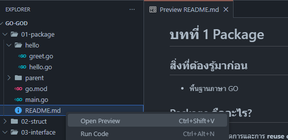

# หัวข้อ
1. [Package](https://github.com/Nextjingjing/go-god/tree/main/01-package)
2. [Struct](https://github.com/Nextjingjing/go-god/tree/main/02-struct)
3. [Interface](https://github.com/Nextjingjing/go-god/tree/main/03-interface)
4. [Error Handling & Logging](https://github.com/Nextjingjing/go-god/tree/main/04-error-handling)
5. Go Concurrency
6. Context
7. Environment Variables
8. Project Structure & Go Module
9. GORM
10. Hexagonal Architecture
11. Fiber
12. gRPC
13. Kafka
14. Testing
15. Dockerfile & Prometheus

# คำนำ
Repository นี้ไม่มีการสอนพื้นฐานภาษา Go เพราะฉะนั้นผู้อ่านต้องศึกษาด้วยตนเอง Repository ต้องการให้ผู้อ่านเรียนรู้เรื่องที่สำคัญเป็นส่วนๆ เพื่อให้สามารถทบทวนได้ง่ายๆ และเตรียมความพร้อมให้ผู้อ่านทำโปรเจคใหญ่ๆ เช่น Microservice, Backend ต่างๆ ได้ และผมพยายามให้เป็นแต่ละบทเรียนเรียบง่ายที่สุดเท่าที่จะเป็นไปได้

# ความต้องการผู้สอน
- ต้องมีพื้นฐานภาษา Go
- ต้องมีความรู้ Docker
- ต้องเคยทำ Backend มาบ้างๆ หรือรู้ระบบบ้าง

# วิธีเรียน
```bash
git clone https://github.com/Nextjingjing/go-god.git
cd go-god
```

กด Preview `README.md` ของแต่ละบทเพื่ออำนวยความสะดวกในการอ่าน Documents ต่างๆ หรือจะอ่านใน Github ก็ได้



## การเรียน
เข้าไปในโฟลเดอร์บทเรียนที่คุณสนใจ และเปิดเอกสารอ่านได้ โดยการอ่านเอกสารต้องประกอบกับการอ่านโค้ดในไฟล์ต่างๆ ซึ่งผมจะเขียนบอกไว้อยู่แล้วให้ไปอ่าน

## คำแนะนำ
- อาจจะต้องลองรันโค้ดบ้าง
- ลองแก้โค้ดดูผลลัพธ์
- หากสงสัยให้ถาม `Generative AIs` ได้ ไม่ผิดครับ